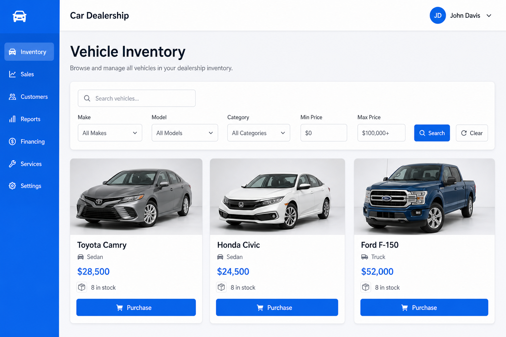
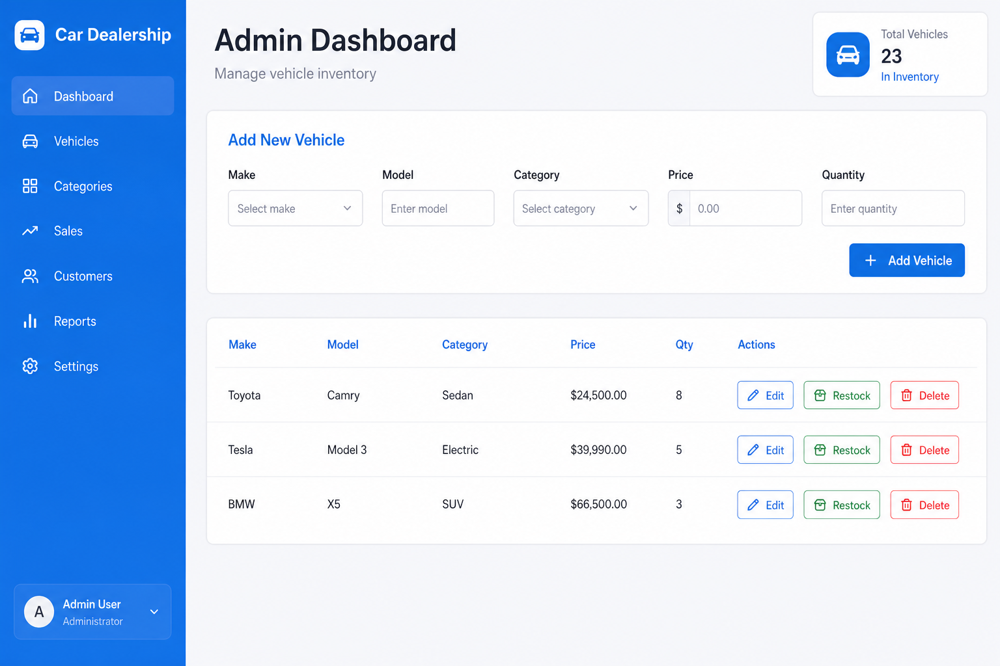

# Car Dealership Inventory System

A full-stack application for managing a car dealership's vehicle inventory. Built with **React** (frontend), **Node.js + Express + TypeScript** (backend), and **MongoDB** (database).

## Features

- User registration and JWT-based authentication
- Browse, search, and filter vehicles
- Purchase vehicles (decreases stock quantity)
- Admin: add, update, delete, and restock vehicles

## Project Structure

```
Car Dealership Inventory System/
├── backend/          # Node.js + Express + TypeScript API
├── frontend/         # React + Vite SPA
├── docker-compose.yml
└── README.md
```

## Prerequisites

- [Node.js](https://nodejs.org/) v18 or higher
- [npm](https://www.npmjs.com/) v9 or higher
- [MongoDB](https://www.mongodb.com/) (local install or Docker)
- [Docker](https://www.docker.com/) (optional, for MongoDB)

## Quick Start

From the project root you can also use convenience scripts:

```bash
npm run install:all   # Install backend + frontend dependencies
npm run docker:up     # Start MongoDB via Docker
npm run seed          # Seed admin user + sample vehicles
npm run test          # Run all backend + frontend tests
```

### 1. Start MongoDB

**Option A — Docker (recommended):**

```bash
docker-compose up -d
```

**Option B — Local MongoDB:**

Ensure MongoDB is running on `mongodb://localhost:27017`.

### 2. Backend Setup

```bash
cd backend
cp .env.example .env
npm install
npm run seed    # Creates admin user + sample vehicles
npm run dev
```

The API runs at `http://localhost:5000`.

**Default admin credentials (after seeding):**

| Field    | Value                 |
|----------|-----------------------|
| Email    | `admin@dealership.com` |
| Password | `admin123456`          |

### 3. Frontend Setup

```bash
cd frontend
cp .env.example .env
npm install
npm run dev
```

The app runs at `http://localhost:5173`.

## API Endpoints

| Method | Endpoint | Auth | Role | Description |
|--------|----------|------|------|-------------|
| POST | `/api/auth/register` | No | — | Register a new user |
| POST | `/api/auth/login` | No | — | Login and receive JWT |
| GET | `/api/vehicles` | Yes | Any | List all vehicles |
| GET | `/api/vehicles/search` | Yes | Any | Search by make, model, category, price |
| POST | `/api/vehicles` | Yes | Admin | Add a new vehicle |
| PUT | `/api/vehicles/:id` | Yes | Admin | Update a vehicle |
| DELETE | `/api/vehicles/:id` | Yes | Admin | Delete a vehicle |
| POST | `/api/vehicles/:id/purchase` | Yes | Any | Purchase a vehicle |
| POST | `/api/vehicles/:id/restock` | Yes | Admin | Restock a vehicle |

## Running Tests

### Backend

```bash
cd backend
npm test
npm run test:coverage
```

**Latest test results:** 35 tests passing across unit and integration suites (auth service, vehicle service, auth routes, vehicle routes).

See [TEST_REPORT.md](./TEST_REPORT.md) for the full test report with coverage details.

### Frontend

```bash
cd frontend
npm test
```

**Latest test results:** 8 tests passing (LoginForm, VehicleCard, VehicleSearch component tests).

### All Tests (from project root)

```bash
npm test
```

## Screenshots





## My AI Usage

### Tools Used

- **Cursor AI (Claude)** — Primary development assistant for scaffolding, implementation, debugging, and test writing throughout the project.

### How I Used AI

- **Project scaffolding:** Used Cursor to generate the initial backend folder structure (Express + TypeScript + Mongoose), route/controller/service layering, and frontend React + Vite setup with routing and auth context.
- **API implementation:** AI helped draft the vehicle service (search filters, purchase/restock logic) and JWT auth middleware; I reviewed and adjusted validation rules and error handling manually.
- **Frontend components:** AI generated the initial `VehicleCard`, `VehicleSearch`, and auth form components; I refined styling in `global.css` and wired API calls.
- **Test writing:** Used AI to generate Jest unit/integration tests for the backend and Vitest component tests for the frontend, then verified edge cases (out-of-stock purchase, admin-only routes, duplicate email registration).
- **Seed script & README:** AI assisted with the database seed script for admin bootstrap and documentation for setup instructions.
- **Debugging:** Used AI to troubleshoot MongoDB connection issues, JWT middleware errors, and axios interceptor behavior during development.

### Reflection

AI significantly accelerated boilerplate generation and test scaffolding, letting me focus on business logic and architecture decisions. The most valuable use was generating test cases that covered edge cases I might have missed (e.g., purchase when quantity is zero, admin-only route protection). However, I always reviewed AI output — for example, ensuring the auth service always hashes passwords correctly and that search queries use proper MongoDB regex filters. AI is most effective as a pair-programming partner when combined with manual review and running the test suite after each change.

## License

MIT
